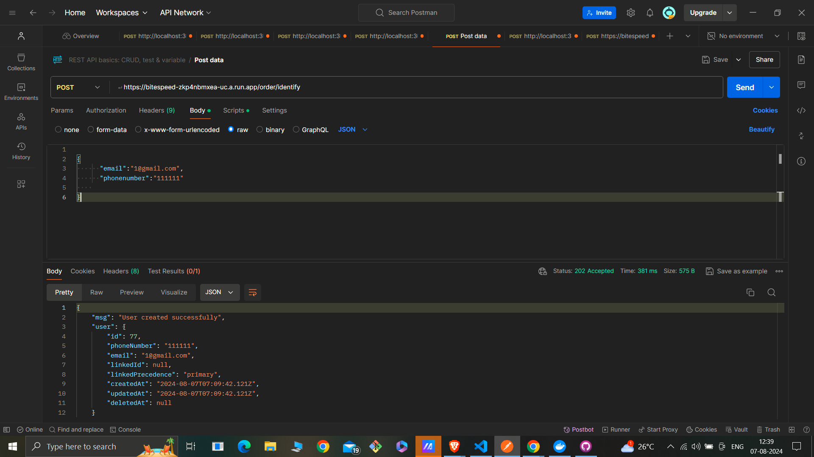

## Readme

# Bitespeed Email and Phone Number Identification

This project is an Express.js application deployed on Google Cloud Run, which interacts with a PostgreSQL database hosted on Neon. The application provides an endpoint to identify users based on their email and phone number.

## Deployed URL

The application is deployed on Google Cloud Run and can be accessed at:

https://bitespeed-zkp4nbmxea-uc.a.run.app

## Endpoint to Test

### Identify User

POST https://bitespeed-zkp4nbmxea-uc.a.run.app/order/identify

This endpoint requires an email and phone number in the request body. You can test this endpoint using Postman or any other API testing tool.

**Example Request Body:**

```json
{
  "email": "example@example.com",
  "phonenumber": "1234567890"
}
```

Setting Up the Project Locally

Follow the steps below to set up and run the project locally:

Prerequisites
Node.js installed on your machine
PostgreSQL database setup on Neon

Clone the repository to your local machine using the following command:

```bash

   git clone https://github.com/ashish07-07/Bitespeed.git

```

## Install Dependencies

Navigate to the project directory and install the required dependencies:

```bash

cd Bitespeed
npm install

```

## Set Up Environment Variables

Create a .env file in the root directory and add the following environment variables. Replace the placeholders with your actual PostgreSQL URL and any other required configuration.

DATABASE_URL=your_neon_postgresql_url

PORT=3000

### When new users Requests:

```json
{
  "email": "example@example.com",
  "phoneNumber": "1234567890"
}
```

### Response:


### When existing user with with same primary email but different phonenumber Requests makes them a secondary users :

### Response:


### primary contacts turn secondary:

when 2 existing primary user requests with one priamry email and priamry phonenumber then one with the phonenumber is linked to priamry email and its linked

### User 1 registers:



### User 2 registers:


### Users 1 email and users2 phone number registers:


